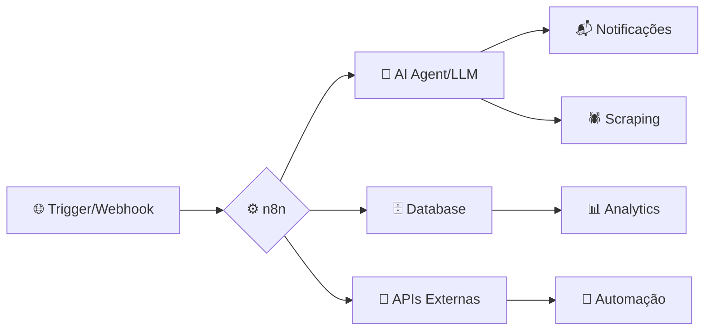

<div align="center">

<!-- ANIMATED BANNER -->


<!-- TYPING ANIMATION -->
[](https://git.io/typing-svg)

<br/>

<!-- PROFILE BADGES ROW -->
<a href="https://github.com/infinitytec15">
  
</a>

<a href="mailto:gilberto@infinitytec.info">
  
</a>

</div>

---

<!-- ABOUT ME SECTION -->


## 🧠 Quem sou eu?

```yaml
name: Gilberto Jr
location: Brasil 🇧🇷
role: Backend Engineer & AI Automation Architect
focus:
  - Inteligência Artificial & LLMs
  - Automação com n8n & Agentes IA
  - Backend de alta performance
  - Scraping, Bots & Microserviços
currently_learning:
  - Multi-Agent AI Systems
  - LangChain & LangGraph
  - RAG Pipelines
  - Cloud-native architectures
fun_fact: "Xadrez no sangue, código na veia ♟️"
```

<br clear="right"/>

---

## 🤖 Engenharia de IA & Automação

<div align="center">

```
╔══════════════════════════════════════════════════════════════╗
║              🧠  STACK DE INTELIGÊNCIA ARTIFICIAL            ║
╠══════════════════════════════════════════════════════════════╣
║  🔗 Orquestração    │  n8n · LangChain · LangGraph           ║
║  🤖 LLMs            │  OpenAI · Gemini · Ollama · Mistral    ║
║  📡 RAG & Vetores   │  Pinecone · ChromaDB · FAISS           ║
║  🕷️ Agentes         │  CrewAI · AutoGen · Multi-Agent        ║
║  🖼️ IA Generativa   │  Stable Diffusion · DALL·E · Midjourney║
║  ⚙️ Automação       │  n8n · Webhooks · Zapier · Make        ║
╚══════════════════════════════════════════════════════════════╝
```

</div>

<div align="center">


</div>

---

## 🛠️ Stack Completa de Tecnologias

### 🚀 Linguagens de Programação

<div align="center">

</div>

### 🧰 Frameworks & Bibliotecas

<div align="center">

</div>

### 🛢️ Bancos de Dados

<div align="center">

</div>

### ⚙️ DevOps, Cloud & Ferramentas

<div align="center">

</div>

---

## 📊 Estatísticas & Atividade

<div align="center">


</div>

<div align="center">

<!-- STREAK STATS - Animated fire streak -->


</div>

---

## 🐍 Snake comendo meus commits!

<div align="center">

<!-- SNAKE ANIMATION ON CONTRIBUTIONS -->
<picture>
  <source media="(prefers-color-scheme: dark)" srcset="https://raw.githubusercontent.com/infinitytec15/infinitytec15/output/github-contribution-grid-snake-dark.svg"/>
  <source media="(prefers-color-scheme: light)" srcset="https://raw.githubusercontent.com/infinitytec15/infinitytec15/output/github-contribution-grid-snake.svg"/>
  
</picture>

</div>

> 💡 **Para ativar a snake:** Adicione um GitHub Action no seu repositório de perfil:
> `.github/workflows/snake.yml` → [Veja o tutorial aqui](https://github.com/Platane/snk)

---

## 📈 Gráfico de Atividade

<div align="center">

[](https://github.com/infinitytec15)

</div>

---

## 🏆 Troféus do GitHub

<div align="center">

[](https://github.com/ryo-ma/github-profile-trophy)

</div>

---

## 🚀 Projetos em Destaque

<div align="center">

| 🎯 Projeto | 🛠️ Stack | 📝 Descrição |
|-----------|---------|-------------|
| 🎰 [**Girowin**](https://girowin.com) | JS · NesteJS · Postgres | Plataforma de cassino online de alta performance |
| 💳 [**Intra Pay**](https://intrapay.io) | Nodejs · Nest · PostgreSQL | Fintech com PIX e pagamentos automatizados |
| 💳 [**Spotty**](https://intrapay.io) | TS - Python - LLM | Sistema para busca de pontos de recarga |
| 💳 [**Host Check**](https://hostcheck.com.br) | Python · React · PostgreSQL | Gestão Inteligente de Hospedes |
| ⚡ [**ChargIn**](https://chargin.io) | PHP · Laravel · Docker | Rede de eletropostos com franquias e IoT |
| 🎯 [**Monitor Loterias Go**](https://github.com/infinitytec15/monitor-loterias-golang) | Go · Goroutines | Monitoramento em tempo real com websockets |
| 🧠 [**Monitor Loterias Py**](https://github.com/infinitytec15/monitor_loterias_python) | Python · Asyncio | Bot de scraping e notificações automáticas |
| 🔋 [**Script Recarga GTA RP**](https://github.com/infinitytec15/script-recarga-gtarp) | Lua · FiveM | Sistema de recarga para servidores RP |
| 🃏 [**Cartas GTA RP**](https://github.com/infinitytec15/cartas_gtaRP) | Lua · FiveM | Jogos de cartas para servidores GTA RP |

</div>

---

## 💡 Curiosidades & DNA de Dev

<div align="center">

```
🤖  Viciado em IA, automações e agentes inteligentes
🕷️  Scraping é arte — n8n + Python é meu combo favorito
♟️  Xadrez afia minha lógica de programação
🌍  Open source first — sempre
⚡  Otimização de backend é um esporte para mim
🧪  Se pode ser automatizado, vai ser automatizado
🔐  Ethical Hacking: entender o sistema para protegê-lo
☁️  Cloud-native: AWS · Docker · Kubernetes no sangue
```

</div>

---

## 🔧 Workflow de Automação com n8n



---

<div align="center">

<!-- FOOTER WAVE -->


**"Automatize o que é repetitivo. Construa o que é impossível."**

[](mailto:gilberto@infinitytec.info)
[](https://github.com/infinitytec15)

⭐️ Feito com 🧠 + ❤️ + ☕ por **Gilberto Jr** — [@infinitytec15](https://github.com/infinitytec15)

</div>
